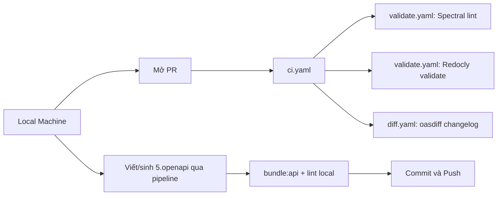

# Hướng Dẫn CI/CD — API Schema Workflow

> Tài liệu này dành cho toàn bộ team, bao gồm dev mới chưa quen với CI/CD lẫn dev đã có kinh nghiệm.
> Cập nhật lần cuối: 16/07/2026 — đối chiếu lại với `.github/workflows/*.yaml` và `package.json` thật trong repo.
> Setup môi trường local (venv, `.env`, GitHub secrets) xem [`setup-local-dev.md`](./setup-local-dev.md) — tài liệu này chỉ nói về quy trình commit/PR/CI sau khi đã setup xong.

---

## Mục lục

- [Hướng Dẫn CI/CD — API Schema Workflow](#hướng-dẫn-cicd--api-schema-workflow)
  - [Mục lục](#mục-lục)
  - [1. Tổng quan hệ thống](#1-tổng-quan-hệ-thống)
  - [2. Quy tắc naming & schema trước khi commit](#2-quy-tắc-naming--schema-trước-khi-commit)
    - [Naming Convention](#naming-convention)
    - [Schema Rules](#schema-rules)
  - [3. Flow làm việc hàng ngày](#3-flow-làm-việc-hàng-ngày)
    - [Bước 1 — Setup lần đầu (chỉ làm 1 lần)](#bước-1--setup-lần-đầu-chỉ-làm-1-lần)
    - [Bước 2 — Tạo branch mới](#bước-2--tạo-branch-mới)
    - [Bước 3 — Viết/sửa OpenAPI và lint local](#bước-3--viếtsửa-openapi-và-lint-local)
    - [Bước 4 — Commit](#bước-4--commit)
    - [Bước 5 — Push và mở PR](#bước-5--push-và-mở-pr)
  - [PR template](#pr-template)
    - [📋 Mô tả thay đổi](#-mô-tả-thay-đổi)
    - [📁 Files thay đổi](#-files-thay-đổi)
    - [✅ Checklist trước khi request review](#-checklist-trước-khi-request-review)
    - [🔗 Liên kết liên quan](#-liên-kết-liên-quan)
    - [💬 Ghi chú cho reviewer](#-ghi-chú-cho-reviewer)
  - [4. CI chạy gì khi mở PR?](#4-ci-chạy-gì-khi-mở-pr)
    - [Xem kết quả CI](#xem-kết-quả-ci)
  - [5. Đọc lỗi Spectral](#5-đọc-lỗi-spectral)
    - [Cấu trúc một dòng lỗi](#cấu-trúc-một-dòng-lỗi)
    - [Ví dụ thực tế và cách fix](#ví-dụ-thực-tế-và-cách-fix)
  - [6. Slack Notification](#6-slack-notification)
  - [7. Câu hỏi thường gặp](#7-câu-hỏi-thường-gặp)

---

## 1. Tổng quan hệ thống



Hệ thống có **2 tầng bảo vệ**:

| Tầng                 | Chạy khi nào   | Mục đích                                |
| -------------------- | -------------- | --------------------------------------- |
| Local (Spectral CLI) | Trước khi push | Phát hiện lỗi sớm, không tốn CI minutes |
| GitHub Actions       | Khi mở PR      | Gate chính — block merge nếu vi phạm    |

---

## 2. Quy tắc naming & schema trước khi commit

### Naming Convention

| Đối tượng             | Quy tắc                                                             | Ví dụ đúng                     | Ví dụ sai                                            |
| --------------------- | ------------------------------------------------------------------- | ------------------------------ | ---------------------------------------------------- |
| Schema file           | PascalCase                                                          | `CreateUserTicketRequest.yaml` | `create-ticket-request.yaml`                         |
| Path operation file   | snake_case (thực tế trong repo, khác với URL path bên dưới)         | `get_user_ticket_detail.yaml`  | `get-user-ticket-detail.yaml`                        |
| URL path (trong YAML) | kebab-case (rule Spectral `path-kebab-case`, severity warn)         | `/user-tickets/{id}`           | `/userTickets/{id}`                                  |
| Thư mục schema        | `components/schemas/<domain>/`                                      | `components/schemas/ticket/`   | `schemas/ticket/`                                    |
| `operationId`         | verbNoun, camelCase (rule `operation-id-verb-noun`, severity error) | `createTicket`, `listUsers`    | `create_ticket`, `Tickets`                           |
| Commit message        | khuyến khích `type(scope): mô tả`, không bắt buộc cứng              | `fix(openapi): ...`            | (không có format sai, chỉ là nên theo cho nhất quán) |

### Schema Rules

```yaml
# ✅ Đúng — dùng $ref
responses:
  200:
    content:
      application/json:
        schema:
          $ref: "#/components/schemas/TicketResponse"

# ❌ Sai — inline schema
responses:
  200:
    content:
      application/json:
        schema:
          type: object
          properties:
            id:
              type: string
```

```yaml
# ✅ Đúng — readOnly cho server-generated fields
components:
  schemas:
    Ticket:
      properties:
        id:
          type: string
          readOnly: true        # ← bắt buộc
        created_at:
          type: string
          format: date-time
          readOnly: true        # ← bắt buộc
```

```yaml
# ✅ Đúng — có đủ error responses
responses:
  200:
    description: Success
  400:
    $ref: "#/components/responses/BadRequest"
  401:
    $ref: "#/components/responses/Unauthorized"
  500:
    $ref: "#/components/responses/InternalServerError"
```

---

## 3. Flow làm việc hàng ngày

### Bước 1 — Setup lần đầu (chỉ làm 1 lần)

Xem đầy đủ ở [`setup-local-dev.md`](./setup-local-dev.md) (venv Python, `.env`, GitHub secrets...). Tóm tắt phần liên quan tới lint/validate:

```bash
git clone <repo-url>
cd "API CONVERTER"
npm install

# Cần có dist/openapi-bundled.yaml trước khi lint được — bundle từ 5.openapi/
npm run bundle:api
npm run lint        # Spectral, output người đọc được
npm run validate    # Redocly
```

Nếu không thấy `error` đỏ ở cả 2 lệnh → setup thành công.

### Bước 2 — Tạo branch mới

```bash
# Luôn tạo branch từ develop, không làm trực tiếp trên main
git checkout develop
git pull origin develop
git checkout -b feature/ten-feature
```

Convention đặt tên branch (theo đúng nhánh thực tế đang có trong repo — `git branch -r`):

| Loại    | Pattern     | Ví dụ                                                    |
| ------- | ----------- | -------------------------------------------------------- |
| Feature | `feature/*` | `feature/error_code`, `feature/ui`, `feature/convert`    |
| Fix     | `fix/*`     | `fix/conflict-resolution`, `fix/resolve-merge-conflicts` |

### Bước 3 — Viết/sửa OpenAPI và lint local

> Cách chính để sinh file trong `5.openapi/` là qua pipeline/dashboard, không phải viết tay YAML từ đầu.

```bash
# Bundle lại 5.openapi/ → dist/openapi-bundled.yaml, rồi lint
npm run bundle:api
npm run lint        # Spectral
npm run validate    # Redocly

# Muốn xem lỗi ở dạng JSON (giống format CI dùng để parse) thì dùng:
npm run lint:spectral
npm run validate:api
```

**Không commit nếu còn lỗi `error`.** Warning (`warn`) có thể commit nhưng phải fix trước khi merge.

### Bước 4 — Commit

Repo hiện **không bắt buộc cứng** 1 format commit message duy nhất (`git log` thực tế có cả message kiểu tự do như `update docs for report` lẫn kiểu Conventional Commits) — nhưng các commit liên quan tới CI/pipeline/openapi thường theo `type(scope): mô tả`, nên dùng theo được thì cứ dùng, để dễ tra lịch sử hơn:

```bash
git add 5.openapi/paths/ticket/create_user_ticket.yaml
git commit -m "fix(openapi): sửa response 500 cho create_user_ticket"

# Scope thường gặp trong git log thật của repo
fix(ci): ...       # sửa workflow/action
chore(openapi): ... # cập nhật bundle tự động từ Dashboard
docs(...): ...      # cập nhật tài liệu
```

### Bước 5 — Push và mở PR

```bash
git push origin feature/ten-feature
```

Mở PR trên GitHub, điền mô tả theo template (xem phần PR bên dưới).

---

## PR template

> Nội dung dưới là tóm tắt — file thật để GitHub tự điền khi mở PR là `.github/pull_request_template.md`, luôn coi file đó là bản chính xác nhất nếu 2 bên lệch nhau.

**Tiêu đề:** mô tả ngắn gọn thay đổi (không bắt buộc format cố định, xem Bước 4)

### 📋 Mô tả thay đổi
<!-- Giải thích ngắn gọn bạn thêm/sửa gì và tại sao -->

### 📁 Files thay đổi
<!-- Liệt kê các file OpenAPI liên quan -->
- `5.openapi/components/schemas/.../XxxYyy.yaml`
- `5.openapi/paths/.../*.yaml`

### ✅ Checklist trước khi request review
- [x] Đã chạy `npm run lint:spectral` + `npm run validate:api` local — không còn lỗi `error`
- [x] Tên file schema đúng **PascalCase**
- [x] Tên thư mục đúng `components/schemas/<domain>/`
- [x] `operationId` đúng format **verbNoun**, camelCase (`createTicket`, `listUsers`…)
- [x] Response schema dùng `$ref`, không inline
- [x] Các field server-generated (`id`, `created_at`…) có `readOnly: true`
- [x] Đủ error responses chuẩn (dùng `$ref` từ `global/response_refs.yaml`, không tự viết tay)
- [x] Đã cập nhật tất cả `$ref` nếu có đổi tên file

### 🔗 Liên kết liên quan
<!-- Ticket Jira / Linear, tài liệu API, PR liên quan nếu có -->
- Ticket:
- Tài liệu:

### 💬 Ghi chú cho reviewer
<!-- Điểm cần review kỹ, context đặc biệt, hoặc trade-off nếu có -->

## 4. CI chạy gì khi mở PR?

Khi mở PR vào `main` hoặc `develop`, `ci.yaml` chạy tuần tự 2 workflow con:

```
ci.yaml (trigger: pull_request → main, develop — không lọc theo path, PR nào cũng chạy)
├── validate.yaml   "Validate OpenAPI Specification"
│   ├── Checkout + setup Node 24 + npm ci
│   ├── npm run lint      (Spectral, ruleset .spectral.yaml)   ← fail → block merge
│   └── npm run validate  (Redocly, redocly.yaml)              ← fail → block merge
│
└── diff.yaml       "Check API Differences"  (chạy sau validate)
    ├── Checkout cả bản PR (new/) và bản main (old/)
    ├── Cài oasdiff
    └── oasdiff changelog old/dist/openapi-bundled.yaml new/dist/openapi-bundled.yaml
        (hiện chỉ in changelog ra log, chưa fail PR nếu có breaking change —
         bước check breaking-change riêng đang bị comment-out trong diff.yaml)
```

**Không có bước check naming (PascalCase) tự động, không có job Slack notify trong `ci.yaml`.** 2 việc đó hiện là thủ công (review bằng mắt qua PR checklist) — xem mục 6 để biết Slack thật ra đang nằm ở đâu.

**Merge chỉ được phép khi `validate` xanh** (branch protection). `diff` hiện là thông tin tham khảo, không block merge.

### Xem kết quả CI

1. Vào tab **Checks** trên PR
2. Click vào job `Validate OpenAPI Specification` để xem lint/validate fail ở step nào
3. Click vào job `Check API Differences` để xem changelog API thay đổi gì so với `main`

---

## 5. Đọc lỗi Spectral

> Giải thích đầy đủ từng rule (Spectral lẫn Redocly) xem [`docs/guidelines/conventions/spectral.md`](../guidelines/conventions/spectral.md) và [`docs/guidelines/conventions/redocly.md`](../guidelines/conventions/redocly.md) — mục dưới đây chỉ nêu vài ví dụ thường gặp.

### Cấu trúc một dòng lỗi

```
/path/to/file.yaml
  LINE:COL  SEVERITY  RULE-CODE  Mô tả lỗi   path.in.document
```

### Ví dụ thực tế và cách fix

Danh sách rule dưới đây lấy đúng từ `.spectral.yaml` hiện tại của repo — nếu file đó đổi thì ví dụ ở đây cũng cần cập nhật lại theo.

**Lỗi 1 — operationId sai format** (`operation-id-verb-noun`, severity `error`)

```
paths/ticket/list_user_tickets.yaml
  5:17  error  operation-id-verb-noun  operationId "tickets_list" sai format, operationId
                                        phải dùng camelCase và bắt đầu bằng động từ —
                                        ví dụ: listUsers, createOrder, reopenTicket.
```

→ Đổi thành `listUserTickets`.

**Lỗi 2 — Server-managed field thiếu `readOnly`** (`server-id-must-be-readonly`, severity `error`)

Áp cho response 200 — field do server sinh ra (`id`, `created_at`, `updated_at`...) phải có `readOnly: true`, nếu thiếu Spectral báo lỗi ngay tại field đó.

→ Thêm `readOnly: true` vào field tương ứng trong schema response.

**Lỗi 3 — Field client gửi lên lại có `readOnly`** (`client-id-must-not-be-readonly`, severity `error`)

Ngược lại lỗi 2 — field trong `requestBody` (client tự gửi) mà lại đánh dấu `readOnly: true` là sai, vì `readOnly` chỉ có ý nghĩa ở response.

→ Bỏ `readOnly: true` khỏi field đó trong schema request, hoặc field đó không nên xuất hiện trong request schema (server-managed thì loại hẳn khỏi request).

**Lỗi 4 — Thiếu response 404** (`operation-with-id-must-have-404`, severity `warn`)

```
paths/ticket/get_user_ticket_detail.yaml
  20:13  warning  operation-with-id-must-have-404  Operation với path parameter phải có
                                                    response 404 (Not Found).
```

→ Path có `{id}` (hoặc tương tự) mà thiếu `404` trong `responses` sẽ bị cảnh báo — thêm `404: $ref: "#/components/responses/NotFound"` (lấy từ `4.config/global/response_refs.yaml`, không tự viết tay).

**Lỗi 5 — Path không đúng kebab-case** (`path-kebab-case`, severity `warn`)

→ Path phải khớp regex `^(/[a-z0-9-]+|/{[a-zA-Z0-9_]+})+$` — ví dụ `/user-tickets/{id}` đúng, `/userTickets/{id}` sai.

> **Lưu ý:** đặt tên **file** schema theo PascalCase (`CreateTicketRequest.yaml`) là quy ước trong `docs/CONVENTIONS.md`/PR checklist, nhưng **không có rule Spectral nào tự động kiểm tra việc này** — hiện đang dựa vào review bằng mắt khi duyệt PR, không phải CI tự chặn.

---

## 6. Slack Notification

**Hiện tại `ci.yaml` (chạy khi mở PR) không gửi Slack** — không có job notify nào trong `ci.yaml`/`validate.yaml`/`diff.yaml`.

Job Slack duy nhất tồn tại trong repo nằm ở `.github/workflows/deploy.yaml` (chạy khi push `5.openapi/**`/`scripts/**`/`package.json` lên `main`/`develop`, không phải khi mở PR) — nhưng job đó **đang bị comment-out toàn bộ**, chưa hoạt động. Muốn bật lại: bỏ comment job `notify` trong `deploy.yaml`, và tạo 2 secret `SLACK_BOT_TOKEN`/`SLACK_CHANNEL_ID` theo hướng dẫn ở [`setup-slack.md`](./setup-slack.md).

---

## 7. Câu hỏi thường gặp

**Q: Tôi mở PR nhưng CI không chạy?**
A: `ci.yaml` trigger cho **mọi PR** vào `main`/`develop`, không lọc theo file thay đổi — nên PR nào cũng chạy `validate` + `diff`, kể cả chỉ sửa `README.md`. Nếu CI vẫn không chạy, kiểm tra lại đúng base branch là `main`/`develop` chưa, hoặc xem tab Actions có bị disable không.

**Q: Vậy còn `deploy.yaml` thì khi nào chạy?**
A: Khác với `ci.yaml` (chạy trên PR) — `deploy.yaml` chỉ chạy khi **push trực tiếp** (không phải PR) lên `main`/`develop`, và chỉ khi commit đó đụng vào `5.openapi/**`, `scripts/**`, hoặc `package.json`. Đây là cơ chế build + publish tài liệu lên GitHub Pages, không liên quan tới việc block merge.

**Q: Warning có cần fix không?**
A: Warning không block merge (CI vẫn xanh) nhưng nên fix trước khi request review. Các rule severity `warn` hiện có trong `.spectral.yaml`: `path-kebab-case`, `property-must-have-description`, `operation-must-have-description`, `operation-with-id-must-have-404`, `post-must-have-2xx`, `delete-must-have-204`, `operation-must-have-tags`.

**Q: Tôi đổi tên schema file thì phải làm gì?**
A: Đổi tên file → tìm tất cả `$ref` trỏ đến file cũ và cập nhật. Dùng lệnh:

```bash
grep -r "OldFileName" --include="*.yaml" .
```

**Q: Sao tôi lint local thì pass nhưng CI lại fail?**
A: Thường do thiếu `npm ci` — dependencies local và CI có thể khác nhau. Chạy `npm ci` rồi lint lại. Cũng kiểm tra lại đã chạy `npm run bundle:api` trước khi lint chưa — cả local lẫn CI đều lint file `dist/openapi-bundled.yaml` (bản đã bundle), không phải lint trực tiếp từng file trong `5.openapi/`.

**Q: Đặt tên file sai PascalCase/snake_case thì CI có tự chặn không?**
A: Không — như đã nói ở mục 5, hiện **không có rule Spectral nào tự động check tên file** (chỉ có `path-kebab-case` check URL path, khác với tên file vật lý). Sai naming file hiện chỉ bị bắt khi reviewer đọc PR bằng mắt theo checklist, CI vẫn xanh bình thường dù tên file sai.

---
