## MỤC 3: PHÂN TÍCH VÀ THIẾT KẾ HỆ THỐNG

### 3.1 Sơ đồ Use Case tổng quát

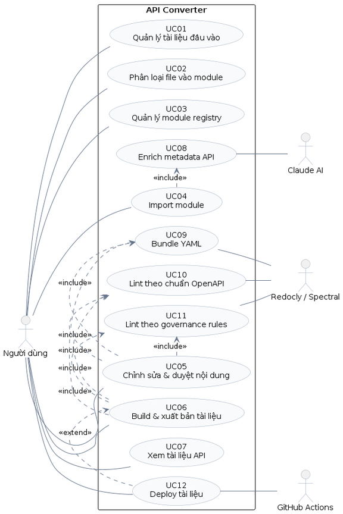

Hệ thống có **12 use case**, 1 tác nhân chính (Người dùng) và 3 tác nhân phụ (Claude AI, Redocly/Spectral, GitHub Actions):

| UC | Tên | Tác nhân chính |
|---|---|---|
| UC01 | Quản lý tài liệu đầu vào | Người dùng |
| UC02 | Phân loại file vào module | Người dùng |
| UC03 | Quản lý module registry | Người dùng |
| UC04 | Import module | Người dùng |
| UC05 | Chỉnh sửa & duyệt nội dung | Người dùng |
| UC06 | Build & xuất bản tài liệu | Người dùng |
| UC07 | Xem tài liệu API | Người dùng |
| UC08 | Enrich metadata API | Claude AI |
| UC09 | Bundle YAML thành 1 file | Redocly |
| UC10 | Lint theo chuẩn OpenAPI | Redocly |
| UC11 | Lint theo governance rules | Spectral |
| UC12 | Deploy tài liệu | Người dùng + GitHub Actions |

### 3.2 Kiến trúc tổng thể

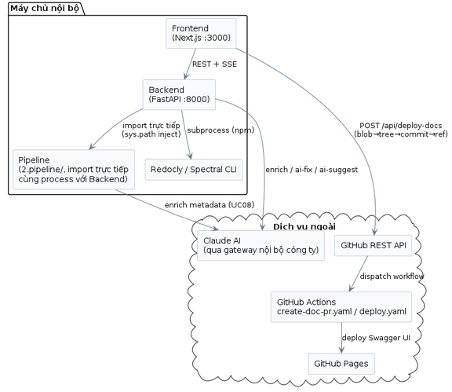

**2 điểm thiết kế cần lưu ý:**
- Backend **không chạy Pipeline như service riêng** — import thẳng module Python (`core/config.py` inject `PIPELINE_DIR` vào `sys.path`). Đơn giản hóa triển khai (1 process duy nhất) nhưng Backend và Pipeline luôn phải cùng version code.
- Tính năng **Deploy đi thẳng từ Next.js server, không qua Backend FastAPI** — logic nghiệp vụ hiện chia làm 2 nơi độc lập.

### 3.3 Chi tiết từng Use Case

#### UC01 — Quản lý tài liệu đầu vào

Người dùng tải tài liệu đặc tả API lên hệ thống và quét thư mục nguồn để phát hiện file mới chưa được xử lý.

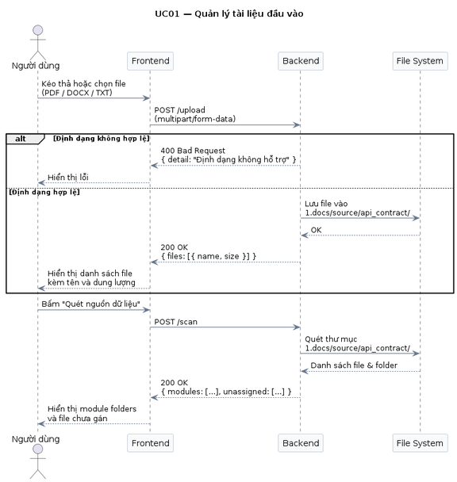
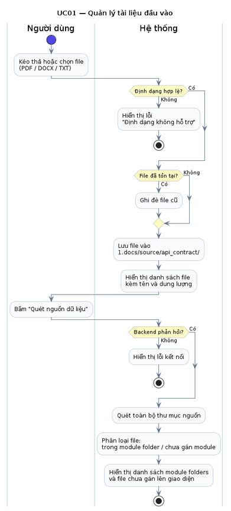

#### UC02 — Phân loại file vào module

Hệ thống gợi ý module phù hợp cho từng file dựa trên `module_resolution.yaml`, người dùng xem xét, duyệt và apply để chuyển file vào đúng thư mục module.

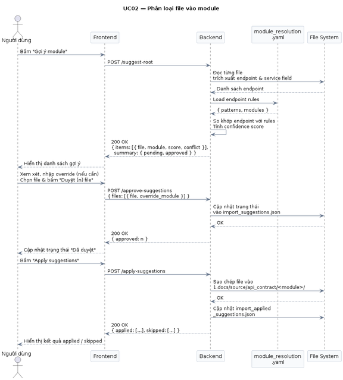
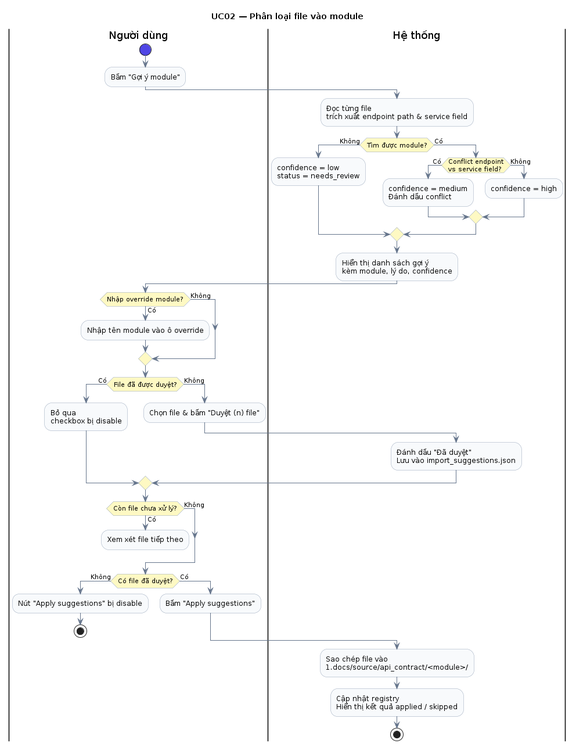

#### UC03 — Quản lý module registry

Người dùng xem danh sách module cùng trạng thái vòng đời, và kích hoạt module từ draft lên active để cho phép chạy pipeline convert.

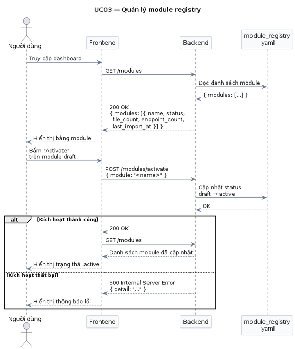
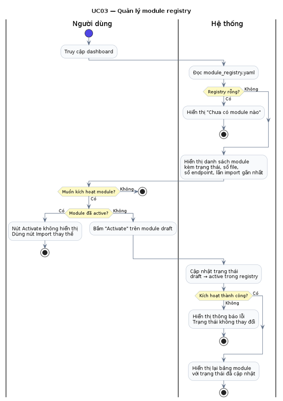

#### UC04 — Import module

Hệ thống chạy Pipeline 4 giai đoạn (Convert → Enrich → Generate → Post-process) cho các module active, theo dõi tiến trình qua SSE — 1 sự kiện được phát khi mỗi module hoàn tất.

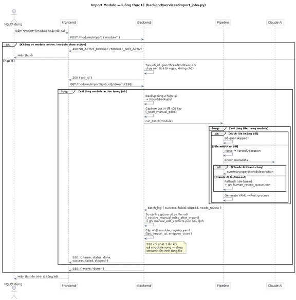
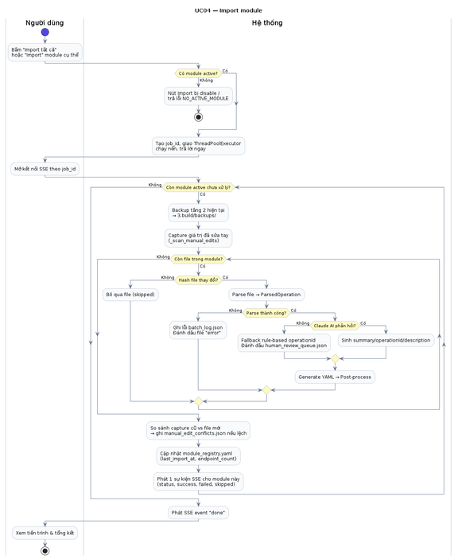

#### UC05 — Chỉnh sửa & duyệt nội dung

Người dùng chỉnh sửa summary/description/parameter qua Form Editor hoặc trực tiếp YAML thô; hệ thống đồng bộ ghi cả tầng 2 (`5.openapi/`) và tầng 3 (bundle), đồng thời phát hiện và cho xử lý xung đột khi import lại đè lên nội dung đã sửa tay.

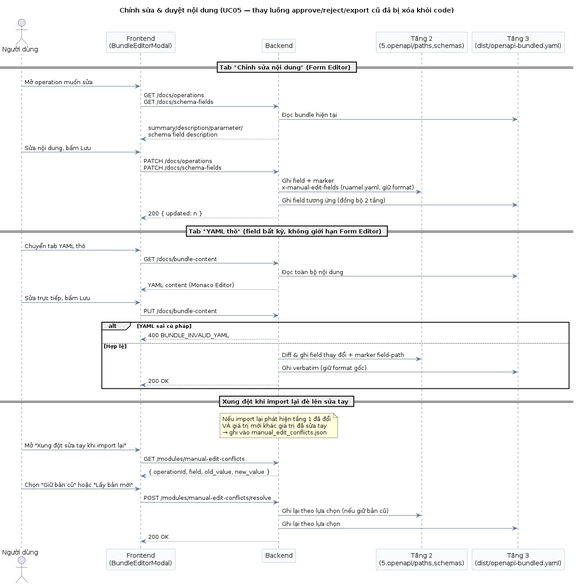
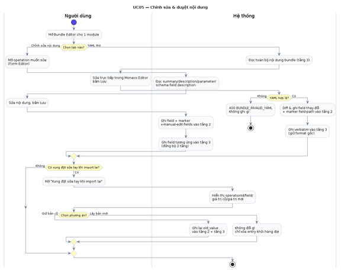

#### UC06 — Build & xuất bản tài liệu

Bundle toàn bộ YAML, lint theo 2 lớp (Redocly + Spectral), build Swagger UI HTML; hỗ trợ xem/sửa bundle trực tiếp và relint không cần build lại từ đầu.

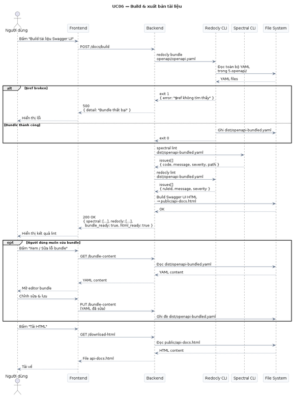
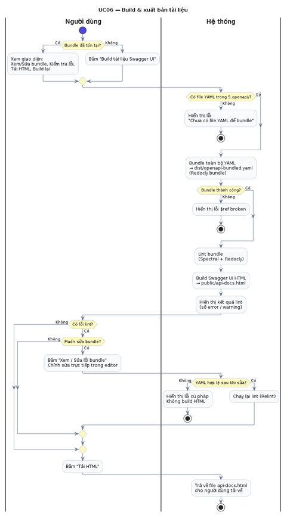

#### UC07 — Xem tài liệu API

Người dùng xem tài liệu API đã build dưới dạng Swagger UI tương tác, tìm kiếm bằng Fuse.js (fuzzy search trên operationId/path/summary/description).

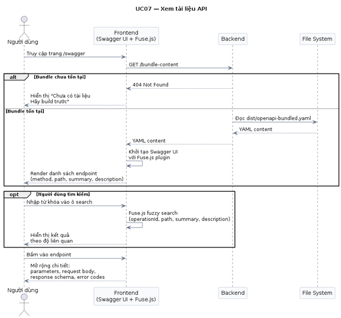
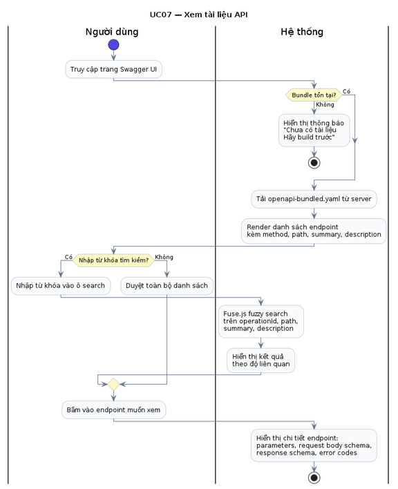

#### UC08 — Enrich metadata API

Claude AI nhận `ParsedOperation` từ Pipeline, sinh `summary`/`operationId`/`description` bằng tiếng Việt; nếu lỗi/timeout, Pipeline tự fallback sinh `operationId` rule-based và đánh dấu vào `human_review_queue.json`.

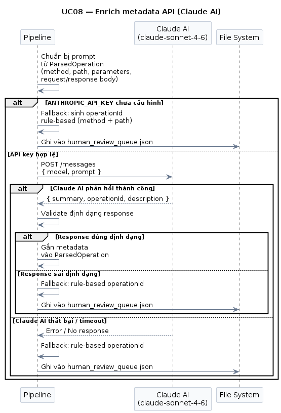
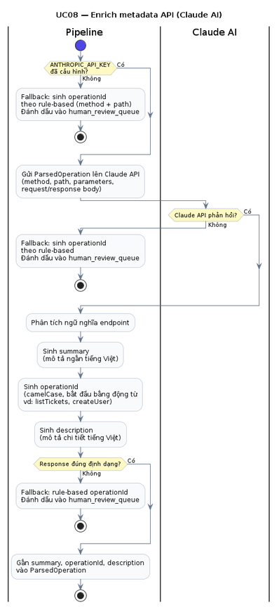

#### UC09 — Bundle toàn bộ YAML thành 1 file

Redocly gom toàn bộ YAML trong `5.openapi/` thành `dist/openapi-bundled.yaml`, giải quyết tất cả `$ref` nội bộ.

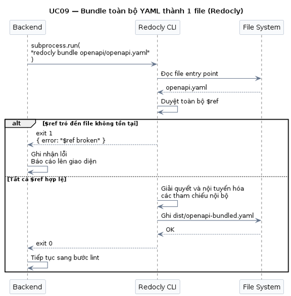
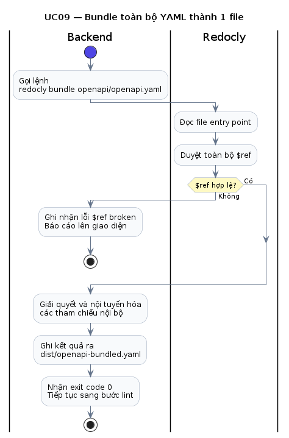

#### UC10 — Lint bundle theo chuẩn OpenAPI

Redocly kiểm tra bundle theo chuẩn OpenAPI 3.1 — thiếu trường bắt buộc, sai kiểu dữ liệu, `$ref` không hợp lệ.

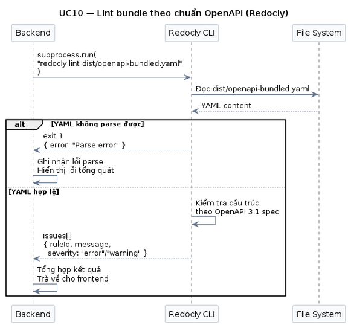
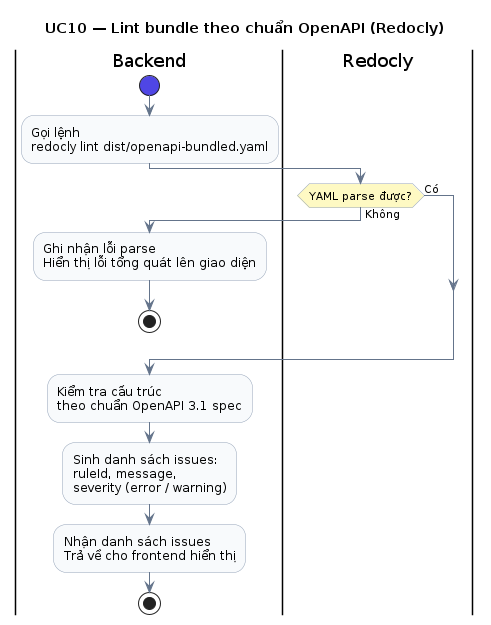

#### UC11 — Lint bundle theo governance rules

Spectral kiểm tra theo bộ ruleset tùy chỉnh của project (operationId camelCase, cấm inline schema, error response chuẩn, server-managed fields readOnly...).

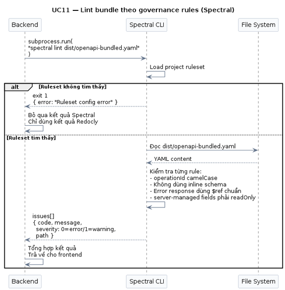
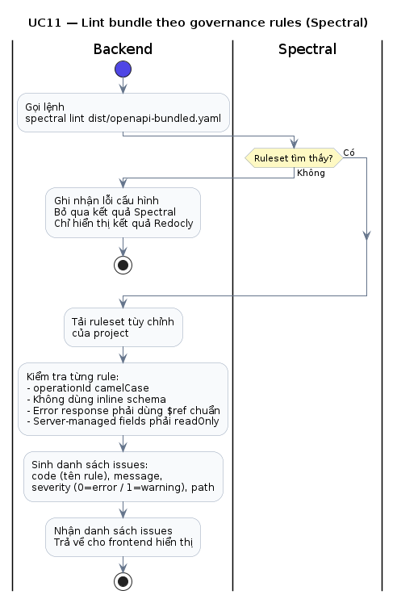

#### UC12 — Deploy tài liệu

Route Next.js gọi trực tiếp GitHub REST API (blob → tree → commit → ref) để tạo nhánh chứa thay đổi `5.openapi/**`, dispatch workflow mở PR tự động merge và deploy Swagger UI lên GitHub Pages.

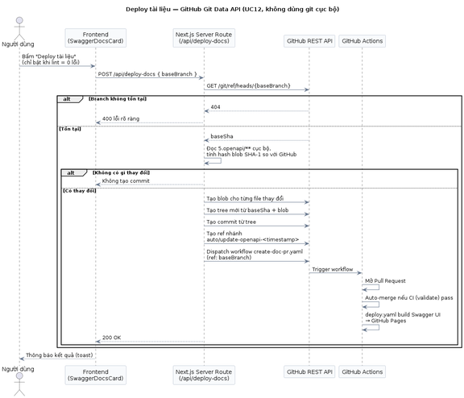
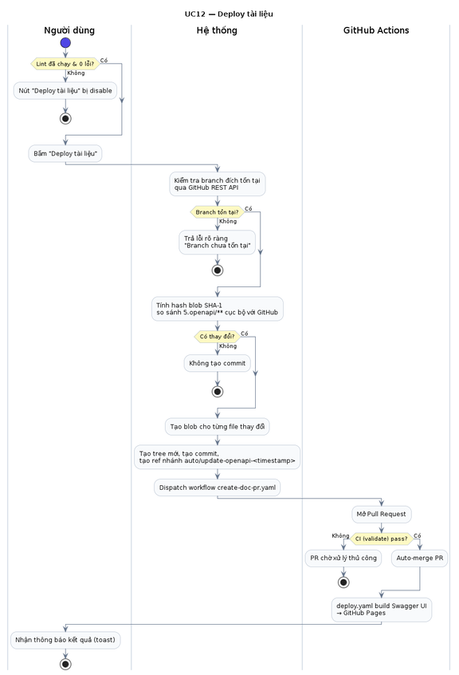

### 3.4 Thiết kế Backend

Kiến trúc phân lớp — **router chỉ parse request/gọi service, toàn bộ logic nằm ở `services/`**:

```
backend/
├── main.py              — FastAPI() + CORS + load_dotenv + include_router()
├── core/
│   ├── config.py         — hằng số đường dẫn, inject Pipeline vào sys.path
│   └── errors.py          — 27 mã lỗi chuẩn hóa (ErrorCode) + http_error()
├── api_utils/             — helper không phụ thuộc nghiệp vụ (field_paths, yaml_line, yaml_io)
├── routers/
│   ├── health.py           — 1 endpoint
│   ├── modules.py          — 13 endpoint (module workflow)
│   └── docs.py             — 12 endpoint (docs & operations)
└── services/                — 10 file, toàn bộ business logic
    ├── module_registry.py, upload.py, suggestions.py, import_jobs.py
    ├── docs_build.py, bundle_content.py, operations.py, schema_fields.py
    ├── bundle_sync.py, manual_edit_conflicts.py, ai_fix.py
```

**Bảng đầy đủ 26 endpoint:**

| Method | Path | Chức năng |
|---|---|---|
| GET | `/health` | Health check |
| GET | `/modules/scan` | Quét thư mục nguồn, phát hiện file chưa gán module |
| GET | `/modules` | Danh sách module + trạng thái vòng đời |
| POST | `/source/upload` | Upload file PDF/DOCX/TXT (validate filename, extension, size, path traversal) |
| GET | `/modules/suggestions` | Xem gợi ý module đang chờ duyệt |
| POST | `/modules/suggest` | Chạy suggest-root, gợi ý module cho file unassigned |
| POST | `/modules/suggestions/approve` | Duyệt gợi ý |
| POST | `/modules/apply` | Copy file vào đúng thư mục module đã duyệt |
| POST | `/modules/{module}/activate` | Kích hoạt module (draft → active) |
| POST | `/modules/{module}/deactivate` | Vô hiệu hóa module |
| POST | `/modules/import` | Chạy Pipeline cho module active, trả `job_id` |
| GET | `/modules/import/{job_id}/stream` | SSE tiến trình import |
| GET | `/modules/manual-edit-conflicts` | Danh sách xung đột sửa tay khi import lại |
| POST | `/modules/manual-edit-conflicts/resolve` | Giữ bản cũ / lấy bản mới cho 1 field xung đột |
| POST | `/docs/build` | Bundle + lint + build Swagger UI HTML |
| GET | `/docs/status` | Trạng thái build/lint gần nhất |
| GET | `/docs/download-html` | Tải file `api-docs.html` |
| GET | `/docs/bundle-content` | Đọc nội dung bundle (tab YAML thô) |
| PUT | `/docs/bundle-content` | Ghi nội dung bundle đã sửa tay |
| POST | `/docs/relint` | Lint lại bundle hiện tại, không build lại từ đầu |
| POST | `/docs/bundle/ai-fix` | Claude đề xuất patch sửa lỗi lint (chỉ trả patch, không tự ghi) |
| GET | `/docs/operations` | Đọc summary/description/parameter/response description (Form Editor) |
| PATCH | `/docs/operations` | Ghi field Form Editor vào cả tầng 2 + tầng 3 |
| POST | `/docs/operations/ai-suggest` | Claude gợi ý mô tả cho field đang trống |
| GET | `/docs/schema-fields` | Đọc schema field dạng cây (request/response data schema) |
| PATCH | `/docs/schema-fields` | Ghi field schema đã sửa |

### 3.5 Thiết kế Frontend

Dashboard 1 trang (`page.tsx`), state tách thành **7 custom hook độc lập**, mỗi hook sở hữu đúng 1 mảng chức năng:

| Hook | Sở hữu |
|---|---|
| `useScan` | Kết quả scan + `fetchScan` |
| `useModuleRegistry` | Danh sách module, activate/deactivate, import (SSE) |
| `useUpload` | Trạng thái upload |
| `useDocsBuilder` | Build/lint/bundle-editor/AI-fix/Deploy |
| `useSuggestions` | Suggest/approve/apply |
| `useManualEditConflicts` | Fetch/resolve xung đột sửa tay |
| `useMounted` | Tránh hydration mismatch (SSR) |

Các hook phụ thuộc lẫn nhau (vd: apply xong cần tự refresh scan) được nối qua **"callback injection"** — hook A không import hook B, mà nhận callback (`onSuccess`, `onApplySuccess`) truyền từ `page.tsx`, giữ đúng 1 instance state cho mỗi hook.

**13 component con** trong `app/_dashboard/` (`ScanCard`, `SuggestCard`, `ModuleRegistryCard`, `ImportCard`, `SwaggerDocsCard`, `BundleEditorModal`, `BundleEditor`, `AiFixPanel`, `OperationsFormEditor`, `SchemaFieldsEditor`, `ManualEditConflictsCard`, `StatTiles`, `WorkflowStepper`) — chỉ nhận props + render UI, không tự gọi API.

### 3.6 Quản lý trạng thái hệ thống

| Loại state | Nơi lưu | Tồn tại qua restart? |
|---|---|---|
| Import job đang chạy | RAM (dict trong Backend) | **Không** |
| Danh sách/trạng thái module | `4.config/module_registry.yaml` | Có |
| Version file nguồn (bỏ qua import không đổi) | `3.build/reports/file_versions.json` | Có |
| Lịch sử chạy pipeline | `3.build/reports/version_run_history.jsonl` | Có (append-only) |
| Gợi ý module chưa duyệt | `3.build/reports/import_suggestions.json` | Có |
| Xung đột sửa tay chưa xử lý | `3.build/reports/manual_edit_conflicts.json` | Có |
