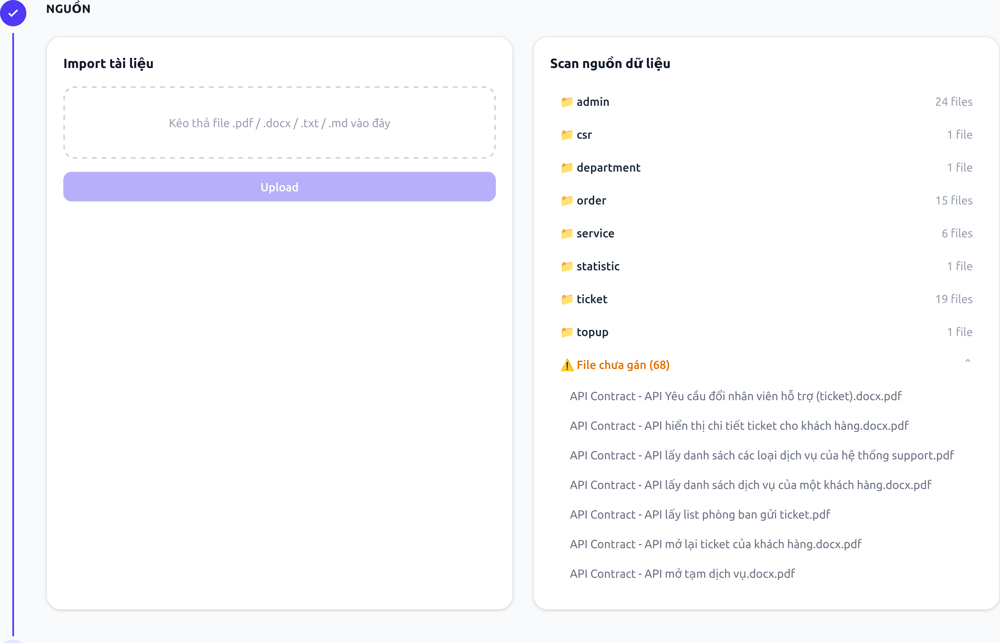
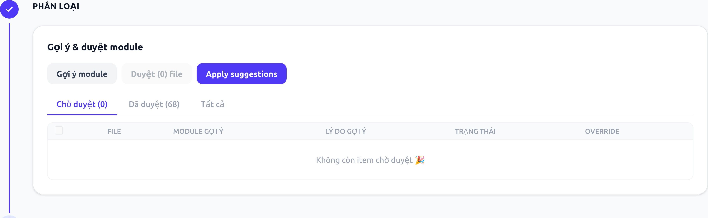
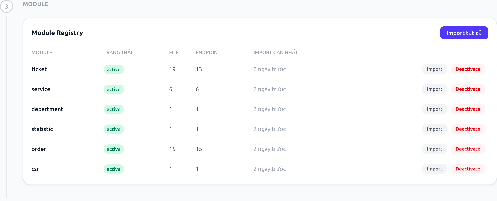
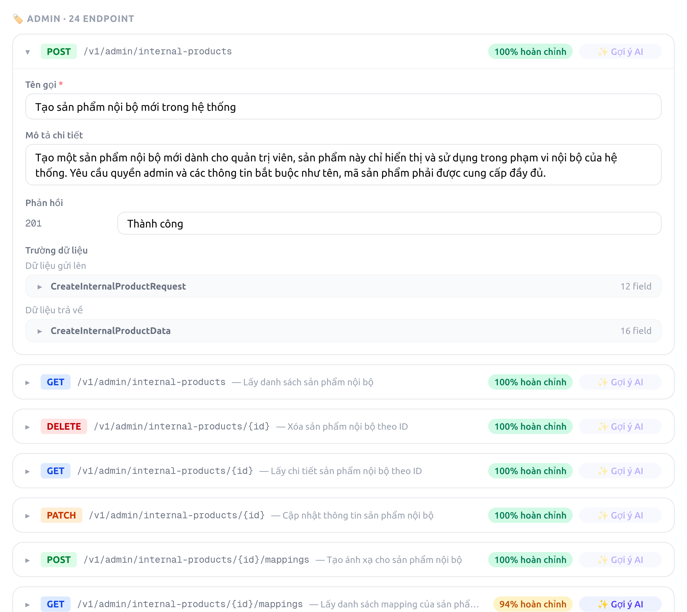
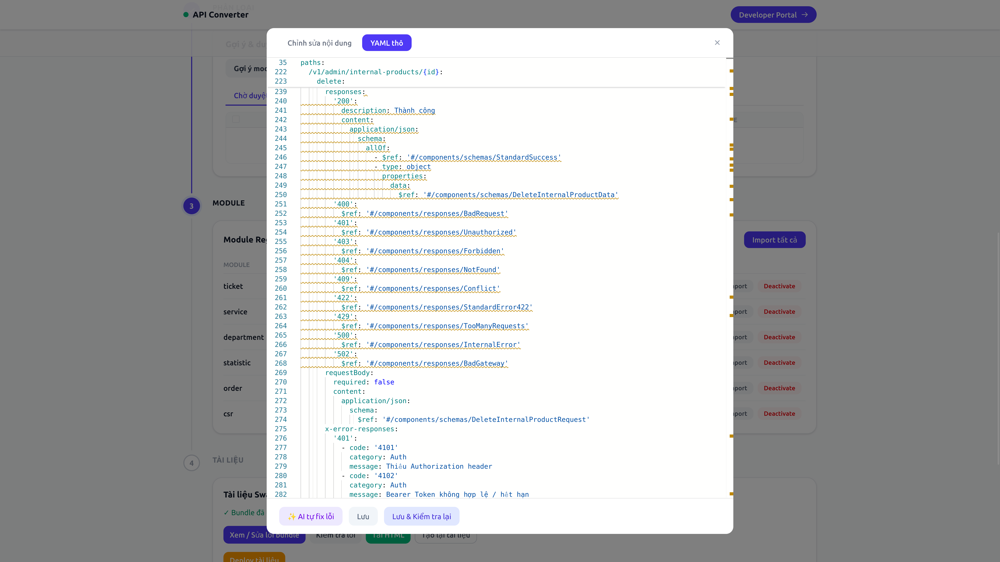
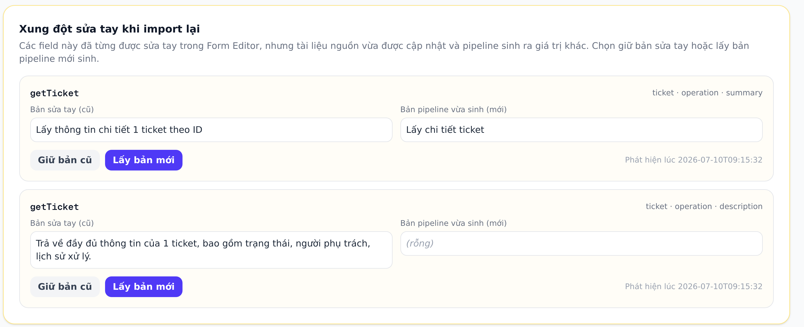
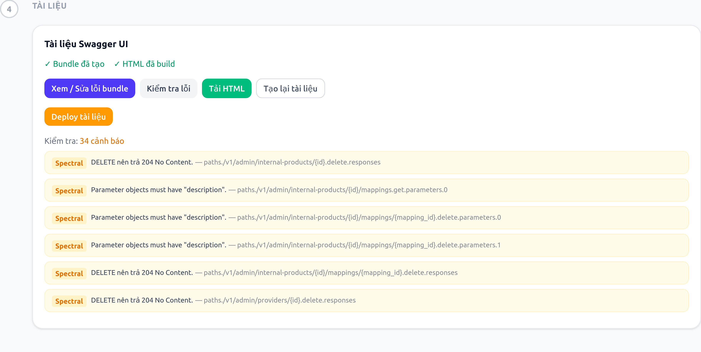
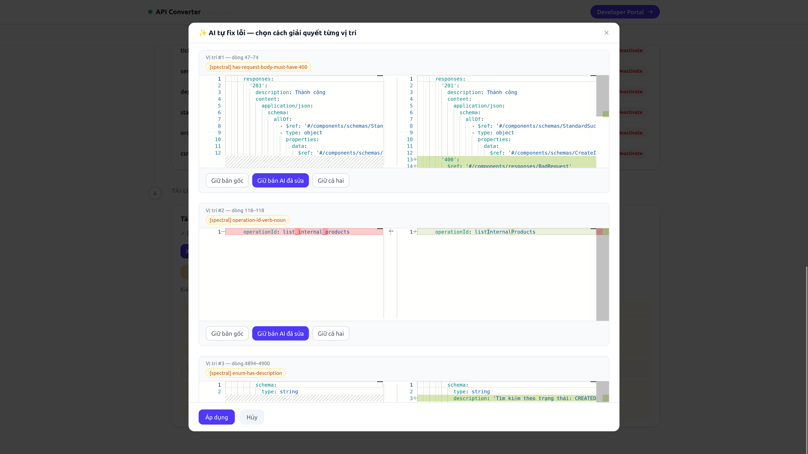

## MỤC 4: CÀI ĐẶT THỰC NGHIỆM VÀ ĐÁNH GIÁ

### 4.1 Cài đặt hệ thống

| UC | Tính năng | Trạng thái | Ghi chú |
|---|---|---|---|
| UC01 | Upload tài liệu + quét nguồn | ✅ Hoàn thành | Có kiểm tra bảo mật path traversal, extension, size cap |
| UC02 | Gợi ý & duyệt module cho file | ✅ Hoàn thành | Có confidence score + phát hiện conflict |
| UC03 | Quản lý vòng đời module | ✅ Hoàn thành | draft → active → deprecated |
| UC04 | Import module (Pipeline 4 giai đoạn) | ✅ Hoàn thành | SSE theo dõi tiến trình cấp module |
| UC05 | Form Editor + YAML thô + xử lý xung đột | ✅ Hoàn thành | Đồng bộ 2 tầng, có gợi ý tự động điền mô tả |
| UC06 | Build & lint & xuất bản Swagger UI | ✅ Hoàn thành | Kèm tự động đề xuất sửa lỗi lint |
| UC07 | Xem tài liệu API (Swagger UI) | ✅ Hoàn thành | Developer Portal đã làm xong nhưng chưa có đường dẫn nào trỏ tới, trùng chức năng với Swagger UI |
| UC08 | Sinh mô tả tự động cho từng API | ✅ Hoàn thành | Có phương án dự phòng khi sinh mô tả thất bại |
| UC09–UC11 | Bundle + lint OpenAPI + lint governance | ✅ Hoàn thành | Bộ quy tắc tùy chỉnh riêng của dự án |
| UC12 | Deploy lên GitHub Pages | ✅ Hoàn thành | Tự mở Pull Request + tự động merge |

**8/8 module nghiệp vụ** (ticket, order, admin, service, csr, department, statistic, topup) đã chạy qua toàn bộ luồng UC01→UC06 với dữ liệu thật, sinh ra **62 endpoint / 94 schema** (số liệu Mục 1).

### 4.2 Giao diện hệ thống

**Nhập & quét tài liệu nguồn (UC01)**

Khu vực kéo-thả file (.pdf/.docx/.txt/.md) và kết quả quét thư mục nguồn — hiển thị số file theo từng module (`admin`: 24, `ticket`: 19, `order`: 15...) cùng danh sách file chưa được gán vào module nào.

**Gợi ý & duyệt module (UC02)**

Giao diện chạy gợi ý module tự động, phân theo 3 tab "Chờ duyệt/Đã duyệt/Tất cả" — trạng thái hiện tại đã duyệt hết 68 file, không còn item chờ xử lý.

**Quản lý module registry (UC03, UC04)**

Bảng danh sách module kèm trạng thái vòng đời (active), số file nguồn, số endpoint đã sinh, thời điểm import gần nhất, và nút Import/Deactivate cho từng module.

**Chỉnh sửa nội dung qua Form Editor (UC05)**

Form chỉnh sửa Tên gọi/Mô tả chi tiết/Phản hồi cho từng endpoint mà không cần đụng vào YAML — có chỉ số "% hoàn chỉnh" theo từng endpoint và nút gợi ý tự động điền mô tả còn trống.

**Chỉnh sửa trực tiếp YAML thô (UC05)**

Tab dành cho chỉnh sửa trường bất kỳ không giới hạn trong Form Editor, hiển thị đúng nội dung bundle qua Monaco Editor kèm dấu hiệu cảnh báo lint ngay trên từng dòng liên quan.

**Xử lý xung đột sửa tay khi import lại (UC05)**

Card hiển thị field từng được sửa tay nhưng import lại sinh ra giá trị khác — cho chọn giữ bản sửa tay hoặc lấy bản mới, kèm thời điểm phát hiện xung đột.

**Build, kiểm tra lỗi và xuất bản tài liệu (UC06, UC12)**

Nhóm nút thao tác chính: xem/sửa lỗi bundle, kiểm tra lỗi, tải HTML, tạo lại tài liệu, và deploy tài liệu — phía dưới là danh sách cảnh báo Spectral theo từng vị trí cụ thể trong file.

**Tự động đề xuất sửa lỗi lint (mở rộng của UC06)**

Với mỗi lỗi lint phát hiện được, hệ thống tự đề xuất bản sửa dưới dạng so sánh 2 cột (gốc/đã sửa), người dùng chọn giữ bản gốc, giữ bản đã sửa, hoặc giữ cả hai cho từng vị trí trước khi áp dụng.

### 4.3 Kiểm thử và lỗi đã phát hiện

Chưa có test tự động — toàn bộ kiểm thử thực hiện **thủ công có kịch bản, có ghi log theo từng ngày**. Mỗi ca kiểm thử có mã số riêng, tiền điều kiện, các bước thực hiện, kết quả mong đợi, và được đối chiếu với kết quả thực tế quan sát được.

| Đợt test | Phạm vi | Kết quả |
|---|---|---|
| 1 | Luồng module + bảo mật upload (19 ca) | ✅ 19/19 đạt |
| 2 | Lưu chỉnh sửa nội dung qua các lần import lại (10 ca) | ✅ Đạt các nhánh test được — còn 1 giới hạn chưa test hết (mục 4.4) |
| 3 | Trường hợp biên khi chỉnh sửa/đồng bộ nội dung (18 ca) | ⚠️ 16/18 đạt, phát hiện 2 lỗi thật |
| 4 | Đồng bộ chỉnh sửa qua các cách nhập liệu khác nhau (9 ca) | ✅ Đạt, phát hiện và sửa ngay 1 lỗi |
| 5 | Cải thiện chất lượng mô tả tự động sinh ra (2 ca) | ✅ Đạt ở mức kiểm tra đơn vị, chưa xác nhận đầu-cuối |

**Tổng: ~58 ca kiểm thử đã chạy qua 5 đợt**, bao phủ 8 nhóm chức năng.

**Lỗi đã phát hiện:**

| Mức độ | Mô tả ngắn | Trạng thái |
|---|---|---|
| Nhẹ | 2 lần backup diễn ra quá sát nhau khiến lần sau bị mất âm thầm | ❌ Chưa fix |
| Trung bình | Xử lý xung đột báo thành công giả khi dữ liệu không còn tồn tại — mất dữ liệu cũ không lấy lại được | ❌ Chưa fix |
| Trung bình | Một trường đánh dấu tự liệt kê chính nó khi so sánh nội dung cũ/mới | ✅ Đã fix trong cùng đợt test |
| Chất lượng nội dung | Mô tả tự động sinh sai nghiệp vụ khi sửa nhiều mục cùng lúc trong 1 lượt | ⚠️ Đang xử lý — hướng khắc phục chưa xác nhận hết |

### 4.4 Giới hạn đã biết

- **Chưa test qua tình huống tài liệu nguồn thay đổi thật** (chỉ test bằng dữ liệu giả lập cách ly) — quyết định có chủ đích để tránh phát sinh chi phí, không phải bỏ sót.
- **Chưa có test tự động** — mỗi lần sửa code sau này đều phải test tay lại theo checklist, tốn thời gian hơn so với có hệ thống test tự động.
- **2 lỗi mức trung bình vẫn còn mở** — cần xử lý trước khi mở rộng quy mô sử dụng, đặc biệt lỗi liên quan đến mất dữ liệu.

### 4.5 Đánh giá hệ thống

- **Tính khả thi:** hệ thống đã chạy được toàn bộ luồng nghiệp vụ trên dữ liệu thật của 8 module, không chỉ dừng ở mức thử nghiệm ý tưởng — đây là cơ sở đủ vững để cân nhắc đưa vào giai đoạn beta như đề xuất ở Mục 1.
- **Mức độ nghiêm túc của kiểm thử:** dù chưa có test tự động, quy trình kiểm thử tay có kịch bản rõ ràng, ghi log đầy đủ, và **công khai cả lỗi chưa fix** — đây là dấu hiệu tốt hơn nhiều so với việc chỉ báo cáo phần thành công.
- **Rủi ro cần xử lý trước khi mở rộng:** 2 lỗi mức trung bình đang mở, trong đó 1 lỗi liên quan trực tiếp đến **mất dữ liệu âm thầm** — nên fix trước khi tăng số lượng người dùng thật sự thao tác trên hệ thống.
- **Điểm chưa được kiểm chứng:** tình huống tài liệu nguồn đổi thật (không phải giả lập) chưa từng chạy qua kiểm thử — đây là khoảng trống cần lưu ý vì đây chính là tình huống sẽ xảy ra thường xuyên nhất khi dùng thật.
- **Kết luận chung:** hệ thống đủ ổn định để thí điểm ở quy mô nhỏ/nội bộ, nhưng chưa nên xem là sẵn sàng vận hành diện rộng cho đến khi xử lý xong các lỗi mức trung bình và bổ sung test cho tình huống còn bỏ ngỏ.
